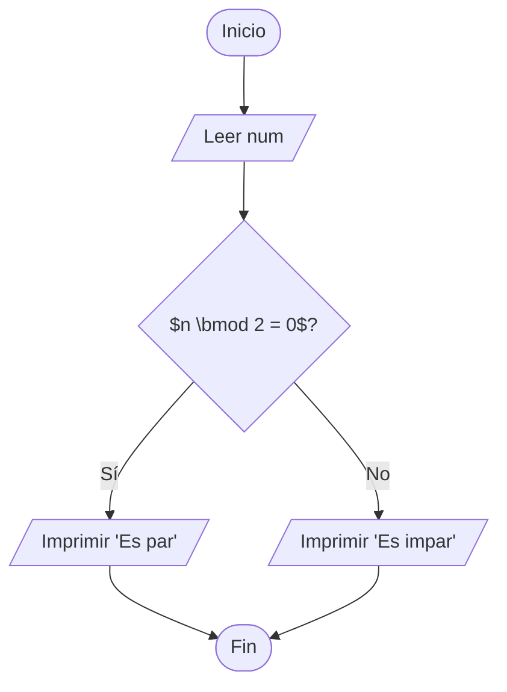
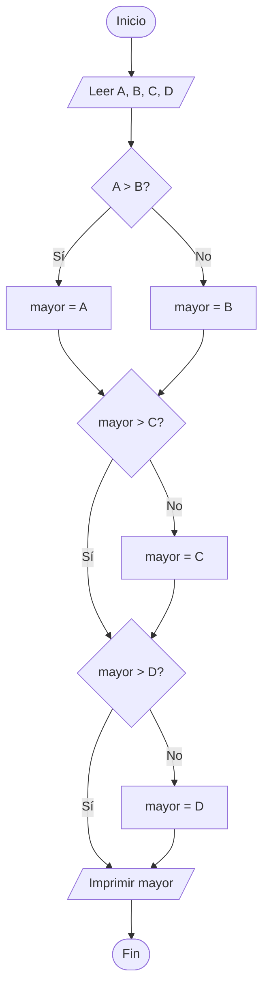

# Semana 1: Fundamentos de Ciencia de Datos y Big Data — Consolidado

| Campo | Detalle |
| ----- | ------- |
| Alumno | Israel Ríos G. |
| Curso | QR.LSTI2309TEO — Universidad Tecmilenio |
| Semana | 1 |
| Temas | T1: Fundamentos de Ciencia de Datos, T2: Big Data |
| Ponderación | 6% |
| Repositorio | Semana1/ |

---

## Ejercicios Complementarios

### Ejercicio 1: Operaciones Algebraicas Básicas

Resolver las siguientes operaciones:

```latex
a)\quad 3x + 5 = 17 \quad \Rightarrow \quad x = \,?\\
b)\quad 2y - 8 = 22 \quad \Rightarrow \quad y = \,?\\
c)\quad 4z + 3 = 3z + 10 \quad \Rightarrow \quad z = \,?\\
d)\quad 5(x + 2) = 35 \quad \Rightarrow \quad x = \,?
```

Solución:

```latex
% --- a) ---
3x + 5 = 17 \\
3x = 17 - 5 \\
x = \frac{12}{3} = 4

% --- b) ---
2y - 8 = 22 \\
2y = 22 + 8 \\
2y = 30 \\
y = \frac{30}{2} = 15

% --- c) ---
4z + 3 = 3z + 10 \\
4z - 3z = 10 - 3 \\
z = 7

% --- d) ---
5(x + 2) = 35 \\
5x + 10 = 35 \\
5x = 25 \\
x = \frac{25}{5} = 5
```

Respuestas: a) $x = 4$, b) $y = 15$, c) $z = 7$, d) $x = 5$

### Ejercicio 2: Funciones Lineales

Dada la función $f(x) = 2x + 3$:

- Calcular $f(0)$, $f(1)$, $f(5)$, $f(10)$
- Graficar la función e identificar la pendiente y ordenada al origen

```python
def f(x):
    return 2*x + 3

print(f(0))   # 3
print(f(1))   # 5
print(f(5))   # 13
print(f(10))  # 23
```

| $x$ | $f(x)$ |
| --- | ------ |
| $0$ | $3$ |
| $1$ | $5$ |
| $5$ | $13$ |
| $10$ | $23$ |

- Pendiente: $m = 2$
- Ordenada al origen: $b = 3$


```python
import matplotlib.pyplot as plt
import numpy as np

def f(x):
    return 2*x + 3

x_line = np.linspace(-2, 12, 100)
y_line = f(x_line)

x_points = np.array([0, 1, 5, 10])
y_points = f(x_points)

plt.plot(x_line, y_line, label='f(x) = 2x + 3', color='blue', zorder=1)
plt.scatter(x_points, y_points, color='red', label='Calculated Points', zorder=2)
plt.axhline(0, color='black', linewidth=1)
plt.axvline(0, color='black', linewidth=1)
plt.grid(True, linestyle='--', alpha=0.6)
plt.legend()
plt.show()
```

### Ejercicio 3: Escalas y Volúmenes (Big Data)

Expresar en notación científica:

| Cantidad | Notación Científica |
| -------- | ------------------- |
| 1,000,000 bytes | $1 \times 10^{6}$ bytes |
| 1,000,000,000 bytes | $1 \times 10^{9}$ bytes |
| 1,000,000,000 registros | $1 \times 10^{9}$ registros |
| 1,000,000,000,000 bytes | $1 \times 10^{12}$ bytes |

Referencia de prefijos:

| Prefijo | Potencia | Valor |
| ------- | -------- | ----- |
| Kilo | $10^{3}$ | 1,000 |
| Mega | $10^{6}$ | 1,000,000 |
| Giga | $10^{9}$ | 1,000,000,000 |
| Tera | $10^{12}$ | 1,000,000,000,000 |
| Peta | $10^{15}$ | 1,000,000,000,000,000 |
| Exa | $10^{18}$ | 1,000,000,000,000,000,000 |

### Ejercicio 4: Diagramas de Flujo

#### Determinar si un número es par o impar



#### Calcular el promedio de 3 números

```mermaid
flowchart TD
    A([Inicio]) --> B[/Leer num1, num2, num3/]
    B --> C["$\bar{x} = \frac{n_1 + n_2 + n_3}{3}$"]
    C --> D[/Imprimir $\bar{x}$/]
    D --> E([Fin])
```

#### Encontrar el mayor de 4 números



### Ejercicio 5: Pseudocódigo

#### Calcular el factorial de un número

```
INICIO

FIN
```

#### Buscar un elemento en una lista

```
INICIO

FIN
```

#### Ordenar una lista de números (Burbuja)

```
INICIO

FIN
```

### Ejercicio 6: Operaciones Booleanas

Evaluar las siguientes expresiones:

```python
a = True
b = False
c = True

print(a and b)          # False
print(a or b)           # True
print(not b)            # True
print(a and c)          # True
print((a or b) and c)   # True
```

### Ejercicio 7: Historia de la Ciencia de Datos

#### La primera científica de datos

#### El "Data Science Venn Diagram" de Drew Conway

#### Herramientas modernas de Big Data

1. Apache Spark: motor de procesamiento de datos en tiempo real, capaz de manejar análisis a gran escala y aprendizaje automático.
2. Apache Kafka: plataforma de transmisión de eventos que permite recolectar y procesar flujos de datos en tiempo real (streaming).
3. Snowflake / Databricks: plataformas basadas en la nube que combinan almacenamiento de datos (Data Warehousing) con capacidades avanzadas de procesamiento y analítica masiva.

### Ejercicio 8: Aplicaciones de Big Data

#### Caso de Estudio: Optimización de Pintura Automotriz — KIA México

Contexto: el monitoreo de variables químicas (pH, conductividad) y físicas (temperatura, presión) en el proceso de pintura se realizaba de forma manual en bitácoras de papel. La falta de datos en tiempo real impedía reaccionar rápido ante desviaciones, generando desperdicio de químicos y retrabajos (Scrap).

Implementación:

- Ingesta de datos: se digitalizan sensores analógicos para capturar más del 80% de los parámetros críticos con frecuencia de refresco de 500 ms mediante protocolo OPC UA.
- Procesamiento local: nodos AWS IoT Greengrass on-premise para análisis de telemetría en tiempo real.
- Almacenamiento y analítica: datos históricos migrados a Amazon Timestream para entrenar modelos de Deep Learning.

Resultados:

- Reducción del 20% en alarmas críticas mediante detección temprana de fallas.
- Gemelo Digital para predecir espesor de capa de pintura por VIN, optimizando energía y químicos en un 10%.
- ROI: inversión de \$450,000 USD, ahorro anual de \$345,000 USD, punto de equilibrio en 1.3 años.

---

## Actividades Prácticas

### Actividad 1.0: Configuración de Git y Repositorio

Repositorio creado en GitHub con la estructura del curso. Primer commit realizado con la estructura inicial de carpetas para las 7 semanas, README.md y archivos .gitkeep.

### Actividad 1.1: Investigación de Conceptos Fundamentales

Contenido cubierto en la sección de Actividad Evaluable (puntos 1 y 2): definición de ciencia de datos, diferencia entre datos estructurados y no estructurados, las 5 V del Big Data y perfiles profesionales.

### Actividad 1.2: Análisis de Casos de Uso

#### Empresas analizadas

**AWS (Amazon Web Services)**

- Datos que recopila: eventos de modificación de configuración en EC2, accesos por puertos habilitados, horas de uso para cobro, datos de monitoreo de hardware virtualizado (uso de CPU, memoria, disco).
- Técnicas de análisis: streaming para monitoreo de recursos en tiempo real con visualización en gráficas y dashboards; procesamiento batch para datos de uso y facturación.
- Problemas que resuelve: cobro automático del servicio, monitoreo proactivo de recursos.

**Amazon (E-commerce)**

- Datos que recopila: registros de ventas, historial de compras, comentarios y reseñas de productos.
- Técnicas de análisis: procesamiento batch para modelar algoritmos y modelos predictivos de recomendación.
- Problemas que resuelve: impulsa ventas recomendadas de productos propios o de afiliados, aumentando la confianza del cliente.

**YouTube (Google)**

- Datos que recopila: historial de videos vistos, interacciones (likes, comentarios, tiempo de visualización).
- Técnicas de análisis: entrena modelos predictivos personalizados para recomendación de videos a cada usuario en su sección de inicio y después de ver un video.
- Problemas que resuelve: aumenta la retención de tiempo de los usuarios en la plataforma y fomenta el interés del usuario al ofrecer contenido sugerido personalizado a sus gustos.

### Actividad 1.3: Configuración del Entorno de Trabajo

Entorno configurado con Python, entorno virtual (venv) y las librerías principales instaladas: NumPy, Pandas, Matplotlib, Seaborn, Scikit-learn. Verificación de instalación realizada con script `verificar_instalacion.py` y notebook `ejemplo_carga_datos.ipynb`.

### Actividad 1.4: Exploración de Fuentes de Datos

#### ¿Qué es Kaggle?

Plataforma gratuita que pone a disposición de los usuarios una serie de problemas para solucionar con temáticas como la ciencia de datos, el análisis predictivo y machine learning.

#### Datasets explorados

1. **YouTube Shorts: Engagement & Growth Velocity 📈**
   - Tipos de datos: string (Video_ID, Title, Channel_Name, Video_URL), int (Views, Likes, Comments, Age_In_Days, Description_Length), float (Engagement_Rate_%, Views_Per_Day)

2. **Student Exam Performance Dataset Analysis**
   - Tipos de datos: int, string, bool, float

3. **Online Learning Engagement Dataset**
   - Tipos de datos: int, string, bool, float

#### Dataset elegido: YouTube Shorts — Engagement & Growth Velocity

- Contiene métricas de visualización y metadata de cada video, además de dos estadísticas derivadas que describen el comportamiento de los viewers.
- Preguntas que se pueden responder: datos básicos de retención de audiencia, apreciación del video por cada vista y qué impacto le dejó a cada usuario. Esto permite saber si el video es publicitado a más gente con gustos similares a los del usuario.

---

## Actividad Evaluable

### 1. Perfiles de Ciencia de Datos

Para atender el caso de DeportivaMX, se recomienda conformar un equipo con los siguientes perfiles:

#### Data Scientist

Transforma los datos recopilados (ventas, clientes, productos) en conocimiento accionable. Realiza análisis exploratorios, prueba hipótesis sobre el comportamiento de los clientes, construye modelos de segmentación, predicción de demanda o recomendación de productos, y colabora con el equipo de negocio para traducir estos modelos en decisiones concretas (promociones, cambios en el catálogo, optimización de precios). Su rol es clave para generar ventajas competitivas mediante modelos de IA y machine learning.

#### Data Engineer

Responsable de la infraestructura que permite recolectar, mover y transformar los datos desde las distintas fuentes: sistemas de ventas, CRM de clientes, catálogos de productos. Diseña y construye el data pipeline que incluye ingestión batch (cargas diarias de ventas históricas) y, si se requiere, ingestión en streaming (transacciones casi en tiempo real). Integra datos heterogéneos en un data lake o data warehouse, garantizando calidad, consistencia y disponibilidad.

#### ML Engineer / AI & ML Specialist

Lleva los modelos validados por los Data Scientists a producción. Diseña la arquitectura para que los modelos se integren con el sistema de ventas, el sitio web o el CRM, de modo que las recomendaciones o predicciones se puedan usar en tiempo real. Monitoriza el desempeño de los modelos, gestiona versiones y ajusta recursos de cómputo.

#### Data Analyst

Explota los datos para responder preguntas específicas del negocio mediante consultas SQL, dashboards y reportes. Crea reportes sobre ventas por producto, tienda o canal, análisis de comportamiento de clientes (frecuencia de compra, ticket promedio, categorías más consumidas) y KPIs de la tienda. Colabora en el uso de herramientas de visualización para obtener insights rápidos.

#### Business Analyst

Actúa como puente entre el negocio y el equipo técnico. Recopila las necesidades de los directivos y áreas comerciales, traduce esas necesidades en requerimientos de datos y analítica, y prioriza las iniciativas. Garantiza que las decisiones estén alineadas con la estrategia y se basen en información precisa.

#### ETL Developer / Data Developer

Se especializa en la creación y mantenimiento de los procesos ETL/ELT que extraen datos de las fuentes operacionales, los transforman (limpieza, normalización, enriquecimiento) y los cargan en repositorios centrales. Diseña los flujos que validan, corrigen inconsistencias y organizan los datos en modelos dimensionales adecuados para análisis.

#### Big Data Architect / IT Architect

Diseña la arquitectura global de datos que soportará todos los casos de uso presentes y futuros. Define qué tecnologías utilizar, cómo se integran los componentes (data lake, data warehouse, herramientas de visualización, plataformas de ML) y qué patrones de arquitectura se emplean para garantizar escalabilidad, seguridad y eficiencia. Define las políticas de gobernanza y buenas prácticas.

En conjunto, estos siete perfiles cubren todo el ciclo de vida de los datos: desde la recolección y organización, pasando por la creación de modelos avanzados y visualizaciones, hasta la definición de arquitecturas robustas y la traducción de resultados en decisiones de negocio.

### 2. Las 5 V del Big Data

Las cinco V permiten mapear y entender las características de los datos y cómo impactan el diseño de la solución para DeportivaMX.

#### 2.1 Volume (Volumen)

El volumen de datos crece constantemente a partir de:

- Registros de ventas históricos (día a día, mes a mes, año tras año).
- Información de clientes (datos de contacto, historial de compras, preferencias).
- Catálogo y características de productos (categorías, precios, inventario, descripciones).

Aunque la empresa quizás no esté aún en petabytes, la arquitectura debe estar preparada para escalar conforme aumentan las transacciones y se integran nuevas fuentes (ventas en línea, campañas digitales, redes sociales). Esto justifica la necesidad de arquitecturas de datos escalables (data lakes, data warehouses en la nube).

#### 2.2 Velocity (Velocidad)

Se refiere a qué tan rápido se generan y necesitan los datos:

- Las ventas se producen en tiempo casi real; cada ticket de compra genera un nuevo registro.
- Las métricas de desempeño (ventas por día, producto más vendido, stock crítico) se deben actualizar con la frecuencia suficiente para tomar decisiones oportunas.
- En un escenario más avanzado, podrían analizarse flujos de datos en streaming (eventos en el e-commerce o interacciones de clientes en tiempo real).

Esto implica diseñar procesos de ingestión batch (cargas periódicas de datos históricos) y, si el negocio lo requiere, streaming (actualizaciones casi inmediatas).

#### 2.3 Variety (Variedad)

Tipos de datos que maneja la tienda:

- Datos estructurados: registros de ventas en el sistema de punto de venta (POS), tablas de clientes y productos en bases de datos relacionales.
- Datos semiestructurados: archivos CSV/JSON exportados del CRM, de la plataforma de e-commerce o de pasarelas de pago.
- Datos no estructurados (potenciales): reseñas de clientes, correos de soporte, mensajes en redes sociales, imágenes de productos.

Esta variedad obliga a diseñar una arquitectura que pueda integrar datos con diferentes esquemas y niveles de estructura (por ejemplo, usando un data lake en la nube).

#### 2.4 Veracity (Veracidad)

La veracidad es crítica porque:

- Los datos de ventas pueden contener errores (tickets duplicados, devoluciones mal registradas, productos asignados a categorías incorrectas).
- La información de clientes puede tener registros incompletos o duplicados (mismo cliente con varios IDs).
- Diferentes sistemas pueden manejar formatos o reglas distintas (monedas, impuestos, zonas horarias).

Durante la fase de Transform en los procesos ETL/ELT se aplican tareas de limpieza y estandarización: eliminación de duplicados, corrección de tipos de datos, normalización de catálogos, validación de reglas de negocio. Las políticas de gobierno de datos ayudan a garantizar que la información sea íntegra y confiable.

#### 2.5 Value (Valor)

El valor responde a la pregunta: ¿para qué estamos recopilando y procesando todos estos datos? En la tienda, el valor se materializa cuando:

- Los análisis permiten identificar patrones de compra para diseñar promociones más efectivas.
- Los modelos predictivos ayudan a anticipar la demanda y optimizar inventarios, reduciendo quiebres de stock y sobreinventario.
- Los dashboards muestran KPIs clave (ventas, margen, rotación, fidelidad de clientes), permitiendo decisiones más rápidas y fundamentadas.
- Se descubren nuevas oportunidades de negocio (nuevas líneas de producto, segmentación por tipo de cliente, canales con mayor potencial).

Los datos dejan de ser solo un registro histórico y se convierten en una herramienta para mejorar la operación, incrementar ingresos, reducir costos y tomar decisiones estratégicas.

### 3. Arquitectura de Almacenamiento

#### Arquitectura propuesta: Data Lakehouse

#### Base de datos NoSQL seleccionada: MongoDB (Documental)

Justificación:

### 4. Diseño de Colecciones en JSON para MongoDB

#### Colección: clientes

```json
{
  "cliente_id": "C123",
  "nombre": "[name]",
  "correo": "[email]",
  "telefono": "[phone_number]",
  "direccion": {
    "calle": "[address]",
    "ciudad": "Ciudad de México",
    "estado": "CDMX",
    "cp": "01234"
  },
  "fecha_registro": "2024-01-15T10:30:00Z",
  "preferencias": ["fútbol", "correr"],
  "metodos_pago": [
    {
      "tipo": "tarjeta",
      "ultimos4": "1234"
    }
  ]
}
```

#### Colección: productos

```json
{
  "producto_id": "P567",
  "nombre": "Tenis para correr",
  "categoria": "Calzado",
  "marca": "MarcaX",
  "precio": 1299.99,
  "stock": 50,
  "tallas_disponibles": [24, 25, 26, 27],
  "colores": ["negro", "azul"],
  "caracteristicas": {
    "material": "malla",
    "genero": "unisex"
  }
}
```

#### Colección: ventas

```json
{
  "venta_id": "V890",
  "fecha": "2024-03-19T15:20:00Z",
  "cliente_id": "C123",
  "items": [
    {
      "producto_id": "P567",
      "cantidad": 2,
      "precio_unitario": 1299.99
    }
  ],
  "total": 2599.98,
  "metodo_pago": "tarjeta",
  "estatus": "completada",
  "canal": "web"
}
```

#### Colección: resenas

```json
{
  "review_id": "R001",
  "cliente_id": "C123",
  "producto_id": "P567",
  "calificacion": 4.5,
  "comentarios": "Excelente calidad y comodidad.",
  "media": [
    {
      "media_id": "M001",
      "tipo": "imagen",
      "url": "/attachments/M001.jpg"
    }
  ],
  "timestamp": "2026-02-28T11:30:50Z"
}
```

---

## Resumen de Aprendizaje


---

## Referencias

1. AWS. "What is Big Data?" — <https://aws.amazon.com/big-data/what-is-big-data/>
2. IBM. "What is Data Science?" — <https://www.ibm.com/topics/data-science>
3. Conway, D. (2010). "The Data Science Venn Diagram" — <http://drewconway.com/zia/2013/3/26/the-data-science-venn-diagram>
4. MongoDB Documentation — <https://www.mongodb.com/docs/>
5. Apache Spark Documentation — <https://spark.apache.org/docs/latest/>
6. Apache Kafka Documentation — <https://kafka.apache.org/documentation/>
7. Mayer-Schönberger, V. & Cukier, K. "Big Data: A Revolution That Will Transform How We Live, Work, and Think."
8. Kaggle — <https://www.kaggle.com/>
9. Pandas Documentation — <https://pandas.pydata.org/docs/>
10. Python — <https://www.python.org/>
