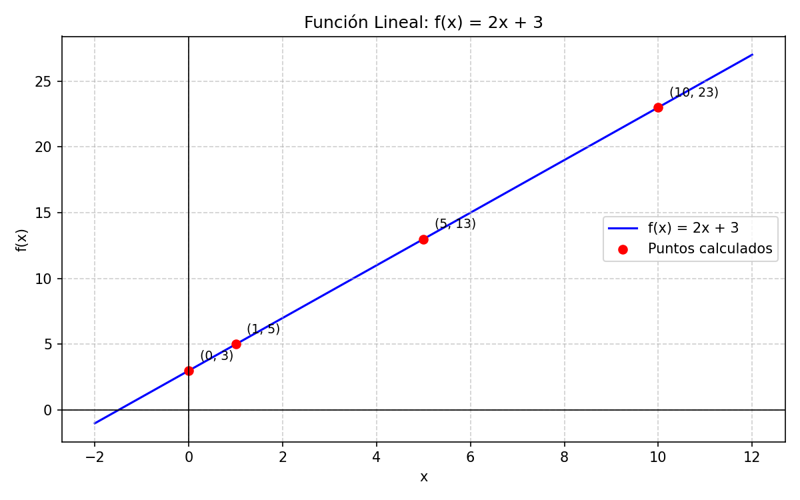
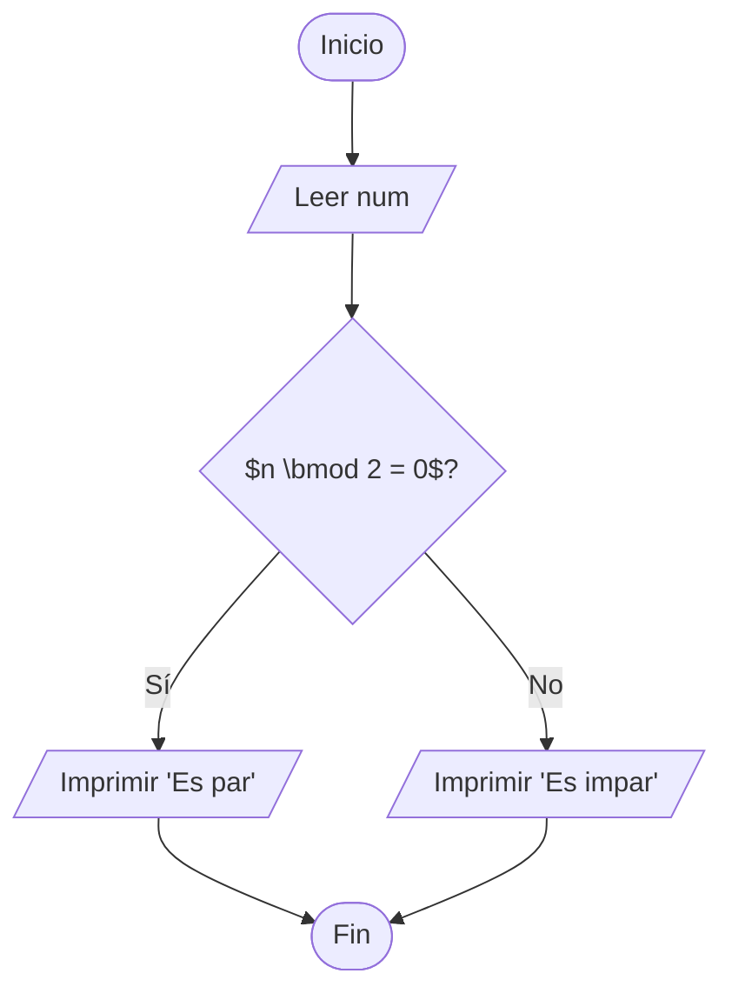
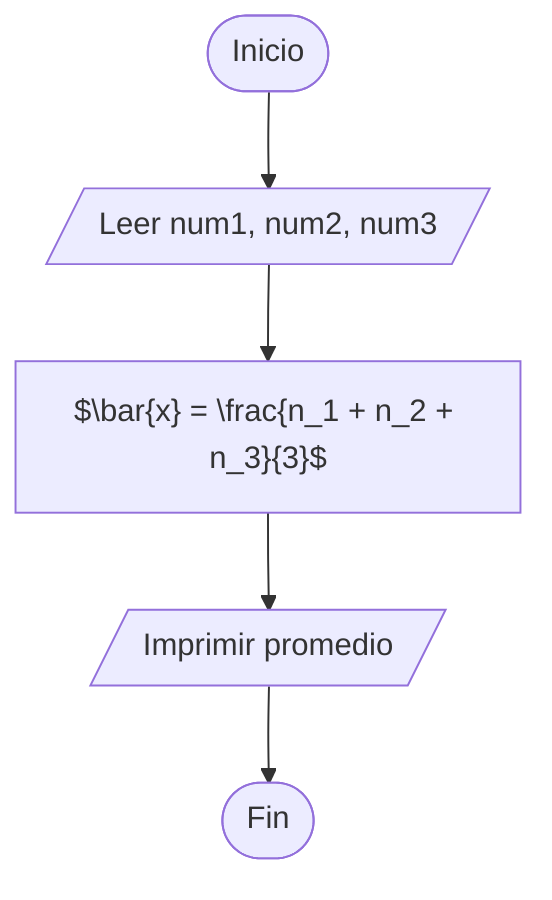
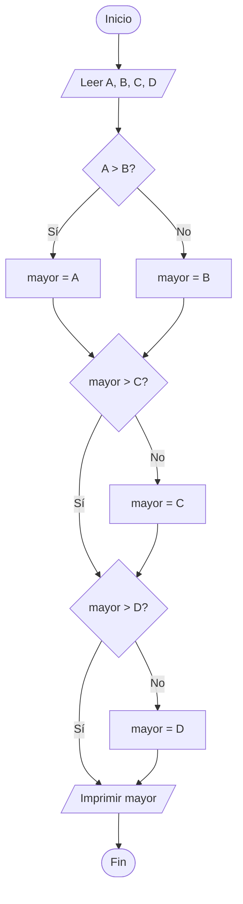

# Ejercicios Complementarios - Semana 1

## Temas Cubiertos
- **T1**: Fundamentos de ciencia de datos
- **T2**: Big Data

## Prerrequisitos Recomendados
- **Matemáticas**: Conceptos básicos de álgebra, escalas y volúmenes
- **Lógica**: Pensamiento computacional básico

---

## Ejercicios de Matemáticas y Álgebra Básica

### Ejercicio 1: Operaciones Algebraicas Básicas
Resolver las siguientes operaciones:

```latex
a)\quad 3x + 5 = 17 \quad \Rightarrow \quad x = \,?
b)\quad 2y - 8 = 22 \quad \Rightarrow \quad y = \,?
c)\quad 4z + 3 = 3z + 10 \quad \Rightarrow \quad z = \,?
d)\quad 5(x + 2) = 35 \quad \Rightarrow \quad x = \,?
```

**Solución:**
- a) $x = 4$
- b) $y = 15$
- c) $z = 7$
- d) $x = 5$

```latex
% --- a) ---
3x + 5 = 17
3x = 17 - 5
x = \frac{12}{3} = 4

% --- b) ---
2y - 8 = 22
2y = 22 + 8
2y = 30
y = \frac{30}{2} = 15

% --- c) ---
4z + 3 = 3z + 10
4z = 10 - 3 + 3z
4z - 3z = 10 - 3
z = 7

% --- d) ---
5(x + 2) = 35
5x + 10 = 35
5x = 35 - 10
x = \frac{25}{5} = 5
```
### Ejercicio 2: Funciones Lineales
Dada la función $f(x) = 2x + 3$:

- Calcular $f(0)$, $f(1)$, $f(5)$, $f(10)$
- Graficar la función e identificar la pendiente y ordenada al origen

```python
def f(x):
    return 2*x + 3

# Calcular f(0), f(1), f(5), f(10)
print(f(0))   # 3
print(f(1))   # 5
print(f(5))   # 13
print(f(10))  # 23
```

La pendiente de la función $f(x) = 2x + 3$ es $m = 2$.
La ordenada al origen es $b = 3$.



### Ejercicio 3: Escalas y Volúmenes (Big Data)
Expresar en notación científica:

| Cantidad                    | Notación Científica |
| --------------------------- | ------------------- |
| 1,000,000 bytes             | $1 \times 10^{6}$ bytes |
| 1,000,000,000 bytes         | $1 \times 10^{9}$ bytes |
| 1,000,000,000 registros     | $1 \times 10^{9}$ registros |
| 1,000,000,000,000 bytes     | $1 \times 10^{12}$ bytes |

**Referencias:**

- $10^{3} = 1{,}000$ (Kilo)
- $10^{6} = 1{,}000{,}000$ (Mega)
- $10^{9} = 1{,}000{,}000{,}000$ (Giga)
- $10^{12} = 1{,}000{,}000{,}000{,}000$ (Tera)
- $10^{15} = 1{,}000{,}000{,}000{,}000{,}000$ (Peta)
- $10^{18} = 1{,}000{,}000{,}000{,}000{,}000{,}000$ (Exa)

---

## Ejercicios de Lógica Computacional

### Ejercicio 4: Diagramas de Flujo
Diseñar un algoritmo simple para:
1. Determinar si un número es par o impar



2. Calcular el promedio de 3 números



3. Encontrar el mayor de 4 números



### Ejercicio 5: Pseudocódigo

Escribir pseudocódigo para:

#### 1. Calcular el factorial de un número

```
INICIO

FIN
```

#### 2. Buscar un elemento en una lista

```
INICIO

FIN
```

#### 3. Ordenar una lista de números

```
INICIO

FIN
```

### Ejercicio 6: Operaciones Booleanas
Evaluar las siguientes expresiones:

```python
a = True
b = False
c = True

# Evaluar:
print(a and b)      # False
print(a or b)      # True 
print(not b)       # True
print(a and c)     # True
print((a or b) and c)  # True
```

---

## Ejercicios de Investigación

### Ejercicio 7: Historia de la Ciencia de Datos

## 1. La primera científica de datos
Aunque el término "Data Scientist" se acuñó formalmente en 2008 (atribuido a DJ Patil y Jeff Hammerbacher), históricamente se considera a **Ada Lovelace** (1815-1852) como la primera pionera en este campo. 

Lovelace no solo fue la primera programadora de la historia, sino que tuvo la visión de que las máquinas podían procesar no solo números, sino cualquier tipo de datos o símbolos, sentando las bases conceptuales de lo que hoy es la ciencia de datos y la computación moderna. En un contexto más enfocado a la estadística aplicada, también se suele citar a **Florence Nightingale**, quien revolucionó el uso de datos y su visualización para influir en políticas de salud pública.

---

## 2. El "Data Science Venn Diagram" de Drew Conway
Creado en 2010, este diagrama es uno de los marcos más famosos para definir qué es un científico de datos. Según Conway, la ciencia de datos se encuentra en la intersección de tres habilidades fundamentales:

* **Habilidades de programación (Hacking Skills):** La capacidad de manipular archivos de texto, usar la línea de comandos y escribir código para recolectar y limpiar datos.
* **Conocimientos de Matemáticas y Estadística:** La base necesaria para elegir los modelos adecuados y validar los resultados.
* **Experiencia sustantiva (Substantive Expertise):** El conocimiento del dominio o negocio que permite formular las preguntas correctas y dar contexto a los hallazgos.

> **Nota importante:** El diagrama también advierte sobre la "Zona de Peligro" (Danger Zone), que ocurre cuando alguien tiene habilidades de programación y conocimiento del tema, pero carece de base estadística, lo que puede llevar a conclusiones erróneas o análisis engañosos.

---

## 3. Herramientas modernas de Big Data
Para manejar volúmenes masivos de datos que las herramientas tradicionales no pueden procesar, hoy se utilizan principalmente:

1.  **Apache Spark:** Un motor de procesamiento de datos en tiempo real extremadamente rápido, capaz de manejar análisis a gran escala y aprendizaje automático.
2.  **Apache Kafka:** Una plataforma de transmisión de eventos que permite recolectar y procesar flujos de datos en tiempo real (streaming).
3.  **Snowflake / Databricks:** Plataformas basadas en la nube que combinan el almacenamiento de datos (Data Warehousing) con capacidades avanzadas de procesamiento y analítica masiva.


### Ejercicio 8: Aplicaciones de Big Data
Caso de Estudio: Optimización de Pintura Automotriz mediante Smart Manufacturing (KIA México)

1. Contexto del Problema

Tradicionalmente, el monitoreo de variables químicas (pH, conductividad) y físicas (temperatura, presión) en el proceso de pintura se realizaba de forma manual en bitácoras de papel. Esta falta de datos en tiempo real impedía una reacción rápida ante desviaciones, generando desperdicio de químicos y retrabajos en las unidades (Scrap).
+4

2. Implementación de Big Data (Arquitectura de Datos)

La solución implementa una arquitectura de Edge Computing que procesa grandes volúmenes de datos industriales sin depender de la nube externa:
+3

Ingesta de Datos (Varianza y Velocidad): Se digitalizan sensores analógicos para capturar más del 80% de los parámetros críticos con una frecuencia de refresco de 500 ms mediante el protocolo OPC UA.
+1

Procesamiento Local: Uso de nodos AWS IoT Greengrass on-premise para el análisis de telemetría en tiempo real, cumpliendo con estrictos protocolos de ciberseguridad industrial.
+2

Almacenamiento y Analítica: Los datos históricos se migran a motores como Amazon Timestream para entrenar modelos de Deep Learning.
+2

3. Resultados y Valor de Negocio (KPIs)

Mantenimiento Predictivo: Reducción del 20% en alarmas críticas mediante la detección temprana de fallas en bombas y filtros.
+1

Calidad Predictiva: Uso de un Gemelo Digital (Digital Twin) para predecir el espesor de la capa de pintura por cada número de serie (VIN), optimizando el uso de energía y químicos en un 10%.
+2

Retorno de Inversión (ROI): Con una inversión inicial de $450,000 USD, se proyecta un ahorro anual de $345,000 USD, logrando el punto de equilibrio en solo 1.3 años.
+2

**Recursos sugeridos:**
- AWS Big Data Documentation
- IBM Big Data Analytics
- Google Cloud Big Data

---

## Recursos Adicionales

### Videos Recomendados
- "What is Data Science?" - IBM
- "Introduction to Big Data" - Apache Hadoop
- "Data Science vs Big Data vs Data Analytics"

### Lecturas Complementarias
- "The Data Science Venn Diagram" - Drew Conway
- "Big Data: A Revolution That Will Transform How We Live" - Viktor Mayer-Schönberger

---

## Próxima Semana
En la Semana 2 cubriremos:
- **T3**: Arquitecturas de almacenamiento de datos
- **T4**: Bases de datos NoSQL
- **T5**: Operaciones CRUD con MongoDB

**Prerrequisitos para próxima semana:**
- Conceptos básicos de SQL
- Estructuras de datos (JSON, diccionarios)
- Python básico
