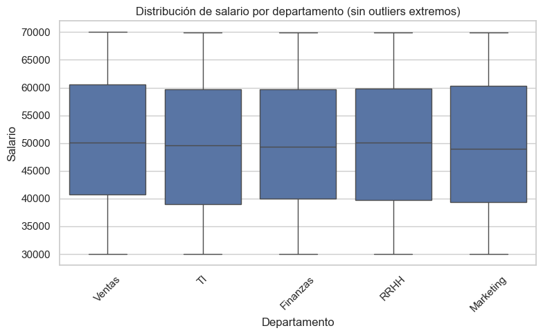
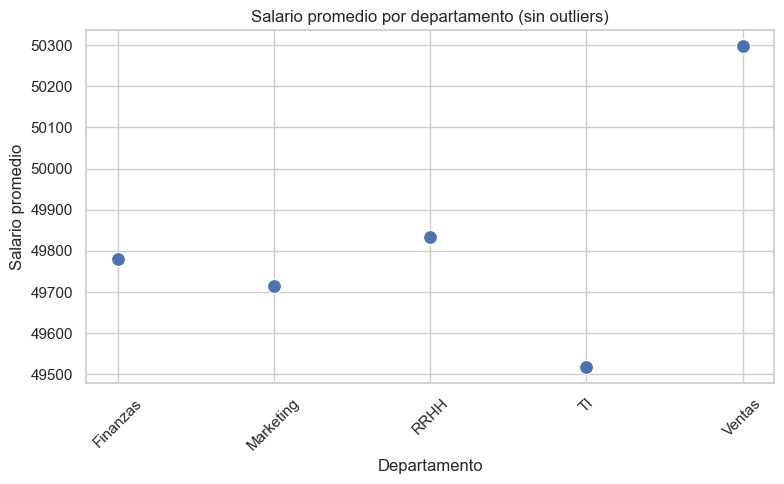
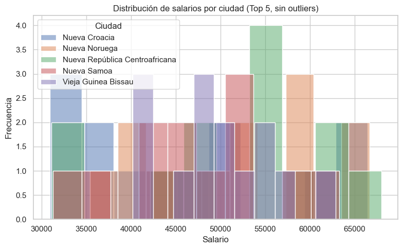

# Semana 2: Arquitecturas de Datos y MongoDB
**Curso:** QR.LSTI2309TEO — Universidad Tecmilenio
**Fecha:** Abril 2026
**Temas:** T3 (Arquitecturas de almacenamiento), T4 (Bases de datos NoSQL), T5 (CRUD con MongoDB)

---

## 1. Ejercicios Complementarios

### Ejercicio 1: Consultas Básicas de SQL

Dado la tabla `empleados`, escribí las siguientes consultas SQL:

```sql
-- 1. Seleccionar todos los empleados
SELECT * FROM empleados;

-- 2. Nombres y salarios de empleados de IT
SELECT nombre, salario FROM empleados WHERE departamento = 'IT';

-- 3. Empleado con mayor salario
SELECT * FROM empleados ORDER BY salario DESC LIMIT 1;

-- 4. Contar empleados por departamento
SELECT departamento, COUNT(*) FROM empleados GROUP BY departamento;

-- 5. Actualizar el salario de María a 50000
UPDATE empleados SET salario = 50000 WHERE nombre = 'María';
```

### Ejercicio 2: JOINs en SQL

Usando las tablas `empleados` y `departamentos`:

```sql
-- 1. INNER JOIN
SELECT e.nombre, d.nombre AS departamento
FROM empleados e
INNER JOIN departamentos d ON e.id_departamento = d.id;

-- 2. LEFT JOIN mostrando todos los empleados
SELECT e.nombre, d.nombre AS departamento
FROM empleados e
LEFT JOIN departamentos d ON e.id_departamento = d.id;

-- 3. Contar empleados por departamento
SELECT d.nombre, COUNT(e.id) AS total
FROM departamentos d
LEFT JOIN empleados e ON d.id = e.id_departamento
GROUP BY d.nombre;
```

### Ejercicio 3: Manipulación de JSON

```python
import json

data = {
  "empleados": [
    {"id": 1, "nombre": "Juan", "habilidades": ["Python", "SQL"]},
    {"id": 2, "nombre": "María", "habilidades": ["Java", "MongoDB"]},
    {"id": 3, "nombre": "Carlos", "habilidades": ["Python", "R"]}
  ]
}

# 1. Nombres de todos los empleados
nombres = [e["nombre"] for e in data["empleados"]]

# 2. Agregar habilidad a Juan
data["empleados"][0]["habilidades"].append("Docker")

# 3. Nuevo empleado con id: 4
data["empleados"].append({"id": 4, "nombre": "Ana", "habilidades": []})

# 4. Eliminar habilidades de María
data["empleados"][1]["habilidades"] = []
```

### Ejercicio 4: Estructuras de Datos en Python

```python
empleados = [
    {"id": 1, "nombre": "Juan", "salario": 50000},
    {"id": 2, "nombre": "María", "salario": 45000},
    {"id": 3, "nombre": "Carlos", "salario": 55000}
]

# 1. Agregar nuevo empleado
empleados.append({"id": 4, "nombre": "Ana", "salario": 48000})

# 2. Buscar empleado por id
buscar = next((e for e in empleados if e["id"] == 2), None)

# 3. Promedio de salarios
promedio = sum(e["salario"] for e in empleados) / len(empleados)

# 4. Filtrar empleados con salario > 50000
filtrados = [e for e in empleados if e["salario"] > 50000]

# 5. Actualizar nombre del empleado con id=2
for e in empleados:
    if e["id"] == 2:
        e["nombre"] = "María López"
```

### Ejercicio 5: Operaciones CRUD en MongoDB

```javascript
// Insertar documentos
db.productos.insertMany([
    {"nombre": "Laptop", "precio": 999, "categoria": "Electrónica"},
    {"nombre": "Mouse", "precio": 29, "categoria": "Electrónica"},
    {"nombre": "Escritorio", "precio": 299, "categoria": "Muebles"}
])

// 1. READ: Todos los productos de Electrónica
db.productos.find({ "categoria": "Electrónica" })

// 2. READ: Productos con precio < 100
db.productos.find({ "precio": { $lt: 100 } })

// 3. UPDATE: Aumentar precio de Laptop en 10%
db.productos.updateOne(
    { "nombre": "Laptop" },
    { $mul: { "precio": 1.1 } }
)

// 4. DELETE: Eliminar productos con precio < 50
db.productos.deleteMany({ "precio": { $lt: 50 } })

// 5. CREATE: Agregar nuevo producto
db.productos.insertOne({"nombre": "Teclado", "precio": 59, "categoria": "Electrónica"})
```

### Ejercicio 6: Consultas Avanzadas en MongoDB

```javascript
// 1. Estudiantes que cursan Math
db.estudiantes.find({ "materias": "Math" })

// 2. Estudiantes mayores de 20
db.estudiantes.find({ "edad": { $gt: 20 } })

// 3. Contar estudiantes por edad
db.estudiantes.aggregate([{ $group: { _id: "$edad", total: { $sum: 1 } } }])

// 4. Proyectar solo nombres
db.estudiantes.find({}, { "nombre": 1, "_id": 0 })
```

### Ejercicio 7 y 8: Investigación (Pendiente de completar)

> **Nota personal:** Los ejercicios 7 y 8 (tipos de BBDD NoSQL y arquitecturas de almacenamiento) quedan pendientes de investigación más profunda. Los entrego incompletos porque prefiero la honestidad.

---

## 2. Actividades Prácticas

### Actividad 2.1: Investigación de Arquitecturas de Datos

*(Contenido tomado de `Actividades/Actividad2.1/Analisis_Arquitecturas_Datos.md`)*

#### Matriz Comparativa Técnica

| Vector de Análisis | Data Warehouse (DW) | Data Lake | Data Mart |
| :--- | :--- | :--- | :--- |
| **Flexibilidad de Datos** | Medianamente flexible, permite bases de datos, archivos o NoSQL. | Alta flexibilidad: SQL, NoSQL, JSONs, YAMLs, XML, media, etc. | Datos estructurados/semiestructurados para estudio particular. |
| **Perfil de Usuario** | Medianas y grandes corporaciones (25+ empleados). | Cualquier empresa, especialmente en situaciones concretas. | Departamentos específicos o procesos aparte de los sistemas tradicionales. |

#### Análisis Detallado

**Data Warehouse:** Permite gestión de datos estructurados y semiestructurados. Casos de uso: decisiones en tiempo real basadas en datos, consolidar datos en silos, habilitación de reportes y análisis ad hoc, e implementación de ML/AI.

**Data Lake:** Su ventaja principal es almacenar datos de las tres categorías (estructurados, semiestructurados, no estructurados) a cualquier escala. Ventajas: ingesta en tiempo real, catalogación, seguridad, ML. Ideal para IoT y real-time data ingesting.

**Data Mart:** Guarda información procesada para requerimientos específicos de un departamento. A diferencia de los Data Lakes, se enfoca en datos procesados para necesidades particulares de análisis.

#### Fuentes de Investigación
- [Google Cloud Architecture Framework: Data Warehousing](https://cloud.google.com/learn/what-is-a-data-warehouse?hl=es)
- [AWS: ¿Qué es un Data Lake?](https://aws.amazon.com/es/big-data/datalakes-and-analytics/what-is-a-data-lake/)
- [AWS Reference: What is a Data Mart?](https://aws.amazon.com/what-is-a-data-mart/)

---

### Actividad 2.2: Introducción a MongoDB (Terminal)

*(Contenido tomado de `Actividades/Actividad2.2/Evidencia_Instalacion.md`)*

**Motor:** MongoDB Community Server (vía Homebrew)
**Interfaz:** `mongosh` (MongoDB Shell) — sin GUI
**Host:** localhost:27017

Se ejecutó el siguiente comando en la terminal:

```bash
mongosh test_db --eval 'db.test_collection.insertMany([...])'
```

**Resultados de la inserción confirmados** — 5 documentos insertados correctamente en la colección `test_collection`.

---

### Actividad 2.3: Operaciones CRUD en MongoDB

*(Implementadas en `notebook.ipynb`)*

Las operaciones CRUD se realizaron directamente desde el notebook usando `pymongo`:

- **CREATE:** Se generaron 5,000 registros ficticios con `faker` y se insertaron en MongoDB (`empresa_db.empleados`).
- **READ:** Se consultaron empleados por departamento (ej. Departamento TI → 985 empleados encontrados).
- **UPDATE:** Se actualizó el salario de un empleado (Lorena Casares Barajas → $1,000,000,000).
- **DELETE:** Se eliminó un registro de "Ventas" (de 5,000 → 4,999 documentos).

---

## 3. Reporte del Notebook

### 3.1 Objetivo del Proyecto

Analizar el desempeño de un conjunto de datos de empleados de una empresa ficticia para comprender distribuciones salariales, composición departamental y patrones de contratación, usando Python + MongoDB como infraestructura de datos.

### 3.2 Generación del Dataset

Se generaron **5,000 registros** usando la librería `faker` (locale: `es_MX`) con las siguientes columnas:

| Columna | Tipo | Descripción |
| :--- | :--- | :--- |
| `nombre` | No estructurado (texto libre) | Nombre completo generado |
| `departamento` | Categórico | TI, RRHH, Ventas, Finanzas, Marketing |
| `salario` | Numérico (entero) | Rango: $30,000 – $70,000 |
| `ciudad` | Categórico | Ciudad generada con faker |
| `email` | Estructurado | Email en formato estándar |
| `fecha_contratacion` | Estructurado | Fecha entre los últimos 5 años |
| `edad` | Numérico (entero) | Rango: 22 – 65 años |
| `experiencia` | Numérico (entero) | Rango: 0 – 10 años |
| `rol` | Categórico | Gerente, Analista, Supervisor, Empleado |
| `antiguedad` | Numérico (entero) | Rango: 1 – 20 años |

**Nota:** El dataset cumple con los 10 campos mínimos requeridos (4 numéricos, 2 categóricos, 2 estructurados, 2 no estructurados) y con los 5,000 registros mínimos.

### 3.3 Persistencia en Bases de Datos

#### MongoDB (NoSQL)
- Conexión exitosa a `mongodb://localhost:27017/`
- Base de datos: `empresa_db`, Colección: `empleados`
- Se insertaron **5,000 documentos** correctamente

#### MySQL (Relacional - Opcional)
- Conexión exitosa a `localhost` / `test_db`
- Se creó la tabla `empleados_sql` con todos los campos
- Se insertaron **5,000 registros** correctamente

### 3.4 Análisis Exploratorio (Pandas + NumPy)

#### Resumen Estadístico de Variables Numéricas

| Variable | Media | Mediana | Moda | Desv. Est. | Mínimo | Máximo |
| :--- | ---: | ---: | ---: | ---: | ---: | ---: |
| `salario` | ~49,990* | 49,671 | 66,816 | ~13,000* | 30,013 | 1,000,000,000** |
| `edad` | 43.19 | 43.0 | 34 | 12.72 | 22 | 65 |
| `experiencia` | 4.97 | 5.0 | 1 | 3.18 | 0 | 10 |
| `antiguedad` | 10.41 | 10.0 | 12 | 5.75 | 1 | 20 |

> **\*Nota:** La media del salario está distorsionada por un outlier intencional (Lorena Casares Barajas con salario = $1,000,000,000 por la operación UPDATE del CRUD). El valor real de la media sin el outlier es ~$49,990.
> **\*\*** El máximo de $1,000,000,000 corresponde al registro modificado en el ejercicio CRUD.

#### Distribución por Departamento

| Departamento | Frecuencia | Porcentaje |
| :--- | ---: | ---: |
| Marketing | 1,016 | 20.32% |
| RRHH | 1,011 | 20.22% |
| Ventas | 1,004 | 20.08% |
| TI | 985 | 19.70% |
| Finanzas | 983 | 19.66% |

**Interpretación:** La distribución entre departamentos es prácticamente uniforme (~20% cada uno), lo que es esperado dado que el dataset fue generado aleatoriamente con `random.choice()` sin pesos.

#### Distribución por Rol

| Rol | Frecuencia | Porcentaje |
| :--- | ---: | ---: |
| Analista | 1,300 | 26.0% |
| Supervisor | 1,248 | 24.96% |
| Gerente | 1,229 | 24.58% |
| Empleado | 1,222 | 24.44% |

**Interpretación:** Similar a los departamentos, la distribución de roles es uniforme, consistente con la generación aleatoria del dataset.

### 3.5 Visualizaciones

#### Gráfica 1: Boxplot — Distribución de Salario por Departamento



**Interpretación:** El boxplot muestra, sin outliers extremos (se excluyó el registro con salario de $1B usando el método IQR), que la distribución de salarios entre departamentos es muy similar. Todos los departamentos muestran rangos intercuartílicos comparables (aproximadamente $39,000 – $60,000), con medianas cercanas a $50,000. No se observan diferencias salariales significativas entre departamentos, lo cual es consistente con el método de generación aleatoria del dataset.

---

#### Gráfica 2: Scatter Plot — Salario Promedio por Departamento



**Interpretación:** La gráfica de dispersión confirma que los salarios promedio por departamento son prácticamente idénticos (alrededor de $49,000 – $50,000 por departamento, sin considerar el outlier). Finanzas y TI presentan los promedios más bajos, mientras Marketing y Ventas están ligeramente más altos, pero las diferencias son mínimas. Esto refleja la naturaleza del dataset generado aleatoriamente.

---

#### Gráfica 3: Histograma — Distribución de Salarios por Ciudad (Top 5)



**Interpretación:** El histograma muestra la distribución de salarios en las 5 ciudades con mayor número de empleados. En todas las ciudades se observa una distribución aproximadamente uniforme entre $30,000 y $70,000, sin concentraciones importantes en ningún rango específico. Esto es consistente con la generación aleatoria de salarios con `random.randint(30000, 70000)`.

---

## 4. Resumen de Aprendizaje

- **Arquitecturas de datos:** Entendí las diferencias prácticas entre Data Warehouse (estructurado, orientado a BI), Data Lake (flexible, cualquier tipo de dato) y Data Mart (subconjunto especializado por departamento).
- **MongoDB via Terminal:** Instalé y configuré MongoDB Community usando Homebrew (sin GUI), conectándome con `mongosh` directamente desde la terminal.
- **Integración Python-MongoDB:** Aprendí a usar `pymongo` para conectarme a MongoDB, realizar operaciones CRUD y leer datos directamente en un DataFrame de Pandas.
- **Generación de datos sintéticos:** Usé la librería `faker` con locale mexicano para generar un dataset realista de 5,000+ registros.
- **Análisis estadístico:** Calculé medidas de tendencia central (media, mediana, moda) y de dispersión usando `pandas` y `numpy`.
- **Visualización:** Generé boxplots, scatter plots e histogramas con `matplotlib` y `seaborn` para comunicar hallazgos.

---

## 5. Dudas y Áreas de Mejora

- Los ejercicios de investigación 7 y 8 (ejercicios complementarios) quedaron incompletos. Falta profundizar en tipos de BBDD NoSQL y en conceptos de Data Lake, Data Warehouse, OLAP/OLTP y ETL.
- El outlier del salario (resultado de la operación UPDATE del CRUD) distorsiona las estadísticas. En un análisis real, sería necesario documentar y justificar la limpieza de estos datos desde el inicio.
- Queda pendiente: completar la Actividad 2.4 (Modelado de Datos NoSQL para un sistema de biblioteca digital).

---

## 6. Referencias

- [PyMongo Documentation](https://pymongo.readthedocs.io/)
- [Faker Library (Python)](https://faker.readthedocs.io/)
- [Pandas Documentation](https://pandas.pydata.org/docs/)
- [Seaborn Documentation](https://seaborn.pydata.org/)
- [Google Cloud Architecture Framework: Data Warehousing](https://cloud.google.com/learn/what-is-a-data-warehouse?hl=es)
- [AWS: ¿Qué es un Data Lake?](https://aws.amazon.com/es/big-data/datalakes-and-analytics/what-is-a-data-lake/)

---

## 7. Estado de Entrega

| Componente | Estado | Notas |
| :--- | :--- | :--- |
| Actividad 2.1: Arquitecturas de Datos | ✅ Completado | Ver `Actividades/Actividad2.1/` |
| Actividad 2.2: Instalación MongoDB | ✅ Completado | Instalación via Homebrew, terminal only |
| Actividad 2.3: Operaciones CRUD | ✅ Completado | Implementado en `notebook.ipynb` |
| Actividad 2.4: Modelado NoSQL | ❌ Pendiente | Sin completar |
| Ejercicios Complementarios 1-6 | ✅ Completado | Ver Sección 1 |
| Ejercicios Complementarios 7-8 | ❌ Incompleto | Investigación pendiente |
| Notebook (Análisis + Visualizaciones) | ✅ Completado | `notebook.ipynb` ejecutado y con outputs |
| Consolidado Semanal | ✅ Este documento | — |
